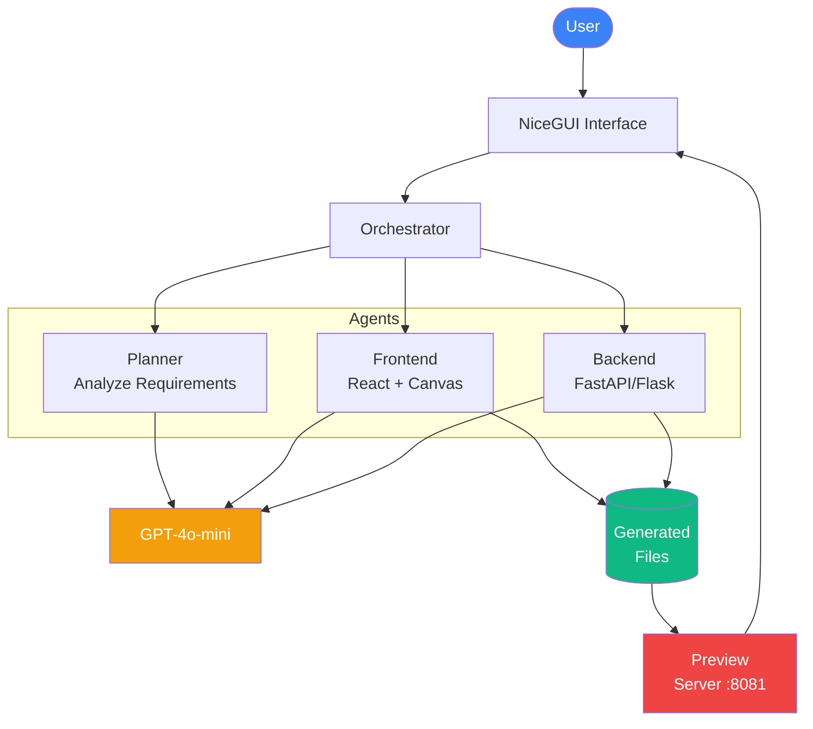
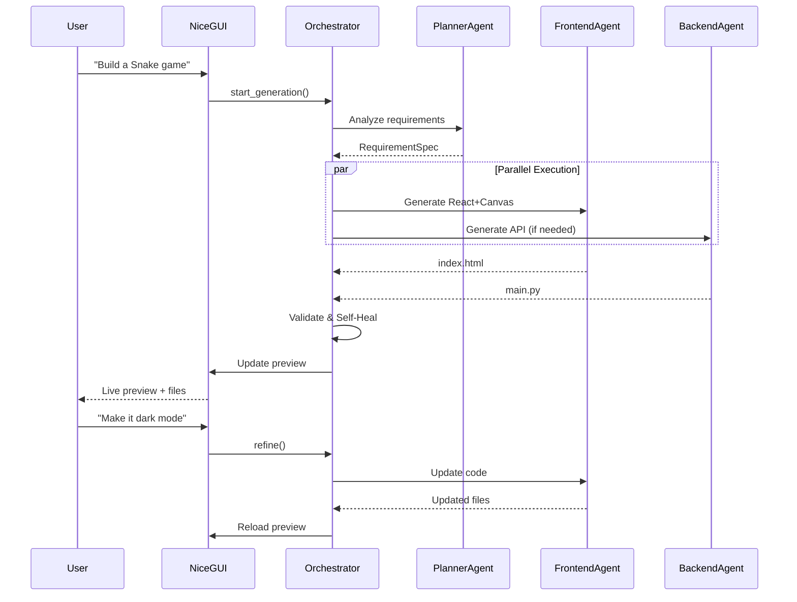
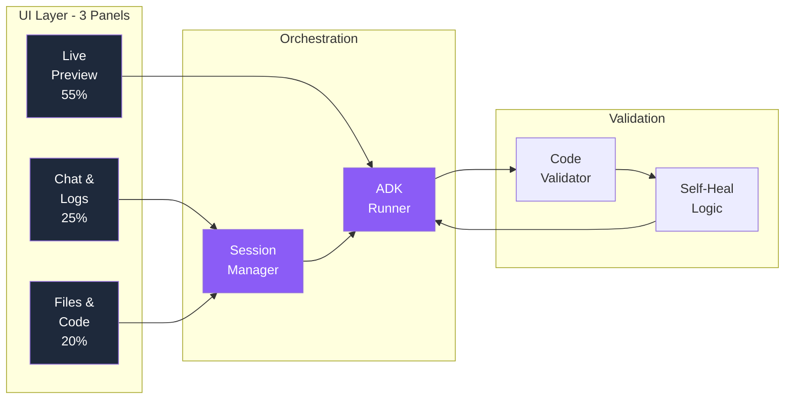

# ⚒️ MetaForge - AI-Powered App Builder

> Transform natural language into working web applications using Google ADK multi-agent orchestration.

  

---

## 🎯 Features

- 🤖 **Multi-Agent AI** - Google ADK orchestrates Planner, Frontend, and Backend agents
- ⚡ **Fast Generation** - Complete apps in under 2 minutes
- 👁️ **Live Preview** - Real-time iframe preview with auto-reload
- 💬 **Chat Refinement** - Iteratively improve through conversation
- 🩹 **Self-Healing** - Automatic error detection and fixes (max 2 retries)
- 📁 **Code Browser** - View generated files with syntax highlighting
- 📊 **Progress Tracking** - Watch agents work in real-time

---

## 🏗️ Architecture

### System Overview



### Execution Flow



### Component Architecture



---

## 🚀 Quick Start

### Installation

```bash
# Clone repository
git clone https://github.com/yourusername/metaforge.git
cd metaforge

# Create virtual environment
python -m venv .venv
source .venv/bin/activate  # Mac/Linux
.venv\Scripts\activate     # Windows

# Install dependencies
pip install -r requirements.txt

# Set API key
export OPENAI_API_KEY='your-key-here'  # Mac/Linux
set OPENAI_API_KEY=your-key-here       # Windows
```

### Run

```bash
python main.py
```

Open **http://localhost:9080**

---

## 📖 Usage

### Good Prompts ✅

```
"Build a Snake game with Canvas, score tracking, and dark mode"
"Create a todo app with categories, due dates, and localStorage"
"Make a calculator with memory functions and keyboard support"
```

### Poor Prompts ❌

```
"Make a game"           → Too vague
"Build an app"          → No specifics
"Create something cool" → No direction
```

### Refinement

```
User: "Build a Snake game"
Bot: ✅ Generated!

User: "Add pause button"
Bot: ✅ Updated!

User: "Increase snake speed"
Bot: ✅ Updated!
```

---

## 🛠️ Tech Stack

| Layer | Technology |
|-------|-----------|
| **LLM** | GPT-4o-mini (OpenAI) |
| **Orchestration** | Google ADK |
| **UI** | NiceGUI (Python) |
| **Generated Frontend** | React 18 + Tailwind/Canvas |
| **Generated Backend** | FastAPI / Flask |
| **Validation** | Python AST + Regex |
| **Preview** | HTTP Server (:8081) |

---

## 📂 Project Structure

```
metaforge/
├── main.py              # Entry point
├── config.py            # Prompts & settings
├── agents/
│   ├── orchestrator.py  # ADK orchestration
│   ├── components.py    # Planner/Frontend/Backend agents
│   └── base.py          # ADK base classes
├── ui/
│   ├── main.py          # NiceGUI app
│   └── components/      # UI panels
├── context/
│   ├── models.py        # Pydantic models
│   └── session_manager.py
├── utils/
│   ├── code_validator.py
│   └── file_manager.py
└── generated_projects/  # Output (gitignored)
```

---

## 🔧 Configuration

Edit `config.py`:

```python
# API
OPENAI_API_KEY = os.getenv("OPENAI_API_KEY", "")
MODEL_NAME = "gpt-4o-mini"

# Ports
NICEGUI_PORT = 9080
PREVIEW_PORT = 8081

# Prompts (see config.py for full text)
REQUIREMENTS_ANALYZER_PROMPT = "..."
FRONTEND_GENERATOR_PROMPT = "..."
BACKEND_GENERATOR_PROMPT = "..."
```

---

## 🐛 Troubleshooting

| Issue | Solution |
|-------|----------|
| **API key error** | `export OPENAI_API_KEY='your-key'` |
| **Preview not loading** | Check port 8081 availability |
| **Keyboard not working in game** | Click the focus overlay in preview |
| **Generation fails** | Check internet connection, verify API key |

---

## 🤝 Contributing

1. Fork the repository
2. Create feature branch (`git checkout -b feature/amazing`)
3. Commit changes (`git commit -m 'Add feature'`)
4. Push to branch (`git push origin feature/amazing`)
5. Open Pull Request

---

## 📄 License

MIT License - see [LICENSE](LICENSE)

---

## 🙏 Acknowledgments

- **Google ADK** - Multi-agent framework
- **OpenAI** - GPT-4o-mini model
- **NiceGUI** - Python web UI

---

<p align="center">
  <strong>Built with ❤️ using Google ADK and NiceGUI</strong><br>
  <a href="#-features">Features</a> •
  <a href="#-quick-start">Quick Start</a> •
  <a href="#-usage">Usage</a> •
  <a href="#-troubleshooting">Troubleshooting</a>
</p>