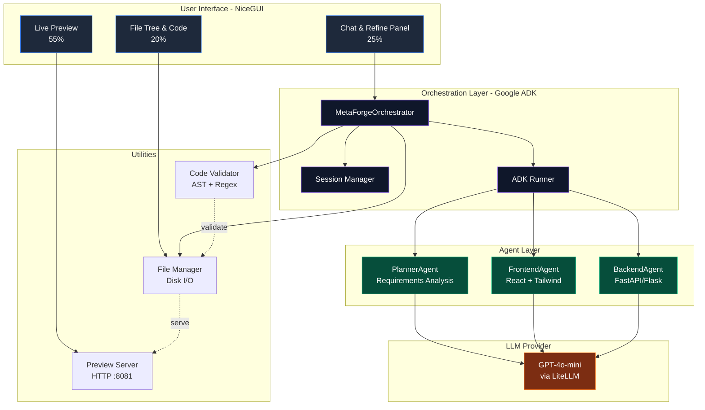
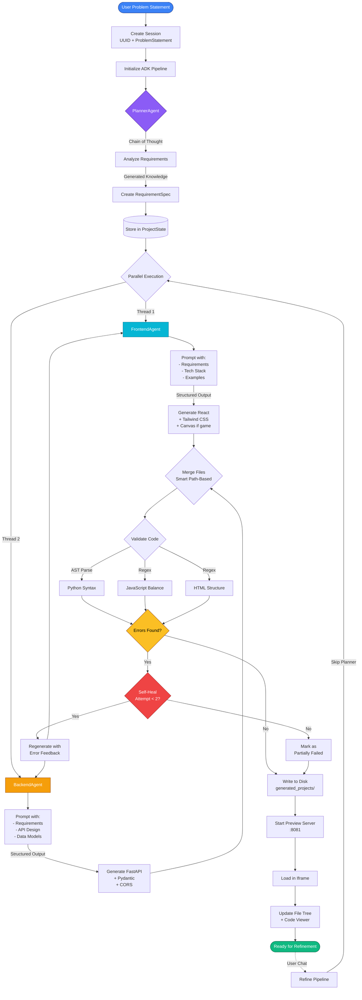
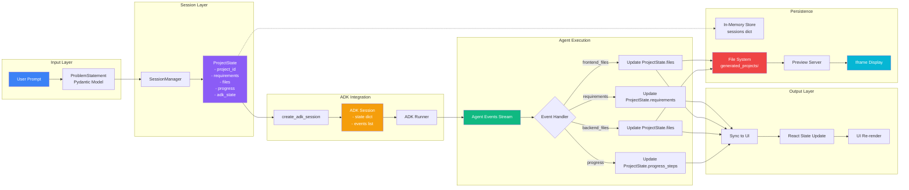

# ⚒️ MetaForge - AI-Powered App Builder

  

**Transform ideas into working applications** using Google ADK multi-agent orchestration and real-time code generation.

MetaForge is an AI-powered application builder that converts natural language problem statements into fully functional web applications with live preview, real-time progress tracking, and iterative refinement capabilities.

---

## 🎯 Features

- 🤖 **Multi-Agent Orchestration** - Google ADK coordinates specialized agents (Planner, Frontend, Backend)
- ⚡ **Lightning Fast** - Generate complete applications in under 2 minutes
- 👁️ **Live Preview** - Real-time iframe preview with auto-reload on changes
- 💬 **Chat-Based Refinement** - Iteratively improve apps through natural conversation
- 🩹 **Self-Healing** - Automatic error detection and fix attempts (max 2 retries)
- 📁 **File Explorer** - Browse generated code with syntax highlighting
- 📊 **Activity Logs** - Watch agents work in real-time
- 📦 **Export Ready** - Download complete projects as ZIP

---

## 🏗️ System Architecture

### High-Level Overview



### Execution Flow

```mermaid
sequenceDiagram
    participant User
    participant UI as NiceGUI UI
    participant Orch as Orchestrator
    participant ADK as ADK Runner
    participant Planner as PlannerAgent
    participant Frontend as FrontendAgent
    participant Backend as BackendAgent
    participant LLM as GPT-4o-mini
    participant Validator as Code Validator
    participant Preview as Preview Server
    
    User->>UI: Enter problem statement
    UI->>Orch: start_generation()
    Orch->>ADK: run(problem, session)
    
    rect rgb(25, 25, 50)
    Note over ADK,Planner: Phase 1: Requirements Analysis
    ADK->>Planner: analyze(problem)
    Planner->>LLM: Generate RequirementSpec
    LLM-->>Planner: {components, tech_stack, complexity}
    Planner-->>ADK: RequirementSpec
    ADK->>Orch: sync to ProjectState
    end
    
    rect rgb(15, 50, 25)
    Note over ADK,Backend: Phase 2: Parallel Code Generation
    par Frontend Generation
        ADK->>Frontend: generate_frontend()
        Frontend->>LLM: Generate React code
        LLM-->>Frontend: FileList (index.html, ...)
    and Backend Generation
        ADK->>Backend: generate_backend()
        Backend->>LLM: Generate FastAPI code
        LLM-->>Backend: FileList (main.py, ...)
    end
    Frontend-->>ADK: Frontend files
    Backend-->>ADK: Backend files
    ADK->>Orch: merge & sync files
    end
    
    rect rgb(50, 15, 15)
    Note over Orch,Validator: Phase 3: Validation & Self-Healing
    Orch->>Validator: validate_code(files)
    Validator-->>Orch: errors[]
    
    alt Has Errors
        loop max 2 retries
            Orch->>ADK: self_heal(errors)
            ADK->>Frontend: regenerate with error feedback
            ADK->>Backend: regenerate with error feedback
            Frontend-->>ADK: Fixed files
            Backend-->>ADK: Fixed files
            ADK-->>Orch: healed files
            Orch->>Validator: re-validate
        end
    end
    end
    
    rect rgb(15, 30, 50)
    Note over Orch,Preview: Phase 4: Preview & Display
    Orch->>Preview: write files & start server
    Preview-->>UI: serve on :8081
    UI->>User: Display in iframe
    end
    
    rect rgb(30, 30, 15)
    Note over User,Backend: Phase 5: Iterative Refinement
    User->>UI: Chat: "make it dark mode"
    UI->>Orch: refine(instruction)
    Orch->>ADK: run refinement pipeline
    Note over ADK: Skip Planner, run coders only
    ADK->>Frontend: update with instruction
    ADK->>Backend: update with instruction
    Frontend-->>ADK: Updated files
    Backend-->>ADK: Updated files
    ADK-->>Orch: Updated ProjectState
    Orch->>Preview: restart with new files
    Preview-->>UI: reload iframe
    UI->>User: Show updated app
    end
```



### Agent Workflow



### Data Flow Architecture



---

## 🚀 Quick Start

### Prerequisites

- **Python 3.10+**
- **OpenAI API Key** (for GPT-4o-mini)
- **Git**

### Installation

```bash
# Clone the repository
git clone https://github.com/yourusername/metaforge.git
cd metaforge

# Create virtual environment
python -m venv .venv

# Activate virtual environment
# Windows:
.venv\Scripts\activate
# Mac/Linux:
source .venv/bin/activate

# Install dependencies
pip install -r requirements.txt

# Set your API key
# Windows:
set OPENAI_API_KEY=your-api-key-here
# Mac/Linux:
export OPENAI_API_KEY=your-api-key-here
```

### Run MetaForge

```bash
python main.py
```

Open your browser to: **http://localhost:9080**

---

## 📖 Usage Guide

### Creating Your First App

1. **Enter your idea** in the problem statement textarea
   ```
   Example: "Build a Snake game with score tracking and dark mode"
   ```

2. **Click "Build now"** to start generation

3. **Watch progress** in the Activity Logs panel (bottom left)

4. **See live preview** in the center panel as code generates

5. **Browse files** in the Project Files panel (right)

6. **Refine iteratively** using the chat interface

### Example Prompts

#### ✅ Good Prompts (Specific)
```
"Create a calculator app with basic operations (+, -, *, /), memory functions, 
and a dark mode toggle. Use a grid layout for buttons."

"Build a todo list with categories, due dates, and priority levels. 
Include filters for completed/pending tasks."

"Make a Snake game with Canvas, arrow key controls, score display, 
pause functionality, and a game over screen."
```

#### ❌ Poor Prompts (Vague)
```
"Make a calculator"
"Build a todo app"
"Create a game"
```

### Iterative Refinement

After initial generation, use the chat to refine:

```
User: "Add a dark mode toggle button"
MetaForge: ✅ Refinement complete! Check updated files.

User: "Increase the snake speed by 20%"
MetaForge: ✅ Refinement complete! Check updated files.

User: "Add sound effects when eating food"
MetaForge: ✅ Refinement complete! Check updated files.
```

---

## 🛠️ Technical Stack

| Component | Technology | Purpose |
|-----------|-----------|---------|
| **LLM** | OpenAI GPT-4o-mini | Code generation via LiteLLM |
| **Orchestration** | Google ADK | Multi-agent coordination |
| **UI Framework** | NiceGUI | Python-based web interface |
| **Frontend (Generated)** | React 18 UMD + Babel | Client-side rendering |
| **Styling (Generated)** | Tailwind CSS CDN | Utility-first CSS |
| **Backend (Generated)** | FastAPI / Flask | REST API server |
| **Validation** | Pydantic + AST | Schema & syntax checking |
| **Preview Server** | Python HTTP | Live app serving (:8081) |
| **State Management** | In-Memory Sessions | ProjectState persistence |

---

## 📂 Project Structure

```
metaforge/
├── main.py                    # Application entry point
├── config.py                  # Configuration & prompts
├── requirements.txt           # Python dependencies
├── pyproject.toml            # Package metadata
│
├── agents/                    # Agent system
│   ├── __init__.py
│   ├── base.py               # ADK base classes & runner
│   ├── components.py         # Planner, Frontend, Backend agents
│   └── orchestrator.py       # Main orchestration logic
│
├── context/                   # State management
│   ├── __init__.py
│   ├── models.py             # Pydantic models
│   └── session_manager.py    # Session CRUD operations
│
├── ui/                        # User interface
│   ├── __init__.py
│   ├── main.py               # NiceGUI app & routing
│   └── components/           # UI components
│       ├── __init__.py
│       ├── landing_page.py   # Hero page
│       ├── progress_panel.py # Chat + logs
│       ├── live_preview.py   # Iframe preview
│       └── file_tree.py      # File browser + code viewer
│
├── preview/                   # Preview server
│   ├── __init__.py
│   └── preview_server.py     # HTTP server for apps
│
├── utils/                     # Utilities
│   ├── __init__.py
│   ├── code_validator.py     # Syntax validation
│   └── file_manager.py       # File I/O operations
│
└── generated_projects/        # Output directory (gitignored)
    └── {session_id}/         # Per-session project folders
```

---

## ⚙️ Configuration

Key settings in `config.py`:

```python
# API Configuration
OPENAI_API_KEY = os.getenv("OPENAI_API_KEY", "")
MODEL_NAME = "gpt-4o-mini"

# Server Configuration
NICEGUI_PORT = 9080
PREVIEW_PORT = 8081

# Paths
OUTPUT_DIR = BASE_DIR / "generated_projects"

# Agent Prompts (See config.py for full prompts)
REQUIREMENTS_ANALYZER_PROMPT = "..."
FRONTEND_GENERATOR_PROMPT = "..."
BACKEND_GENERATOR_PROMPT = "..."
```

---

## 🔧 Advanced Features

### Self-Healing Mechanism

When code validation fails, MetaForge automatically:

1. Captures all syntax errors
2. Feeds errors back to agents with explicit fix instructions
3. Regenerates affected files (max 2 attempts)
4. Re-validates until errors are resolved or retry limit reached

```python
# Example self-heal workflow
try:
    errors = validate_code(files)
    if errors:
        healed_state = await orchestrator.self_heal(
            session_id, 
            errors, 
            max_retries=2
        )
        files = healed_state.files
except Exception as e:
    # Fallback to partial generation
    mark_as_partially_complete()
```

### Live Reload

Preview server monitors file changes and triggers iframe reload:

```python
# Preview auto-reload on refinement
async def refine():
    await orchestrator.refine(instruction, session_id)
    write_files_to_disk(session.files, project_dir)
    preview_server.start(project_dir)  # Restart server
    await live_preview.load_preview()  # Reload iframe
```

### Smart File Merging

Files are merged using path-based deduplication:

```python
# Normalize paths and update existing files
current_files_map = {
    f.path.replace('\\', '/').strip('/'): f 
    for f in state.files
}
for new_file in all_files:
    norm_path = new_file.path.replace('\\', '/').strip('/')
    current_files_map[norm_path] = new_file
```

---

## 🧪 Development

### Running Tests

```bash
pytest tests/ -v
```

### Code Quality

```bash
# Format code
black .

# Lint
pylint agents/ ui/ context/ utils/
```

### Debug Mode

Enable verbose logging:

```python
# In main.py
import logging
logging.basicConfig(level=logging.DEBUG)
```

---

## 🐛 Troubleshooting

### Common Issues

| Issue | Solution |
|-------|----------|
| **"OPENAI_API_KEY not set"** | Set environment variable: `export OPENAI_API_KEY='your-key'` |
| **Preview not loading** | Check port 8081 availability, restart preview server |
| **Generation fails** | Verify API key, check internet connection, review logs |
| **Keyboard not working in game** | Click "Click to Focus" overlay in preview iframe |
| **Files not updating** | Check file permissions in `generated_projects/` |

### Logs Location

- **Application logs**: Terminal output
- **ADK events**: Stored in `ProjectState.adk_events`
- **Validation errors**: Visible in Activity Logs panel

---

## 🤝 Contributing

Contributions are welcome! Please:

1. Fork the repository
2. Create a feature branch (`git checkout -b feature/amazing-feature`)
3. Commit changes (`git commit -m 'Add amazing feature'`)
4. Push to branch (`git push origin feature/amazing-feature`)
5. Open a Pull Request

---

## 📄 License

This project is licensed under the **MIT License** - see the [LICENSE](LICENSE) file for details.

---

## 🙏 Acknowledgments

- **Google ADK** - Multi-agent orchestration framework
- **OpenAI** - GPT-4o-mini language model
- **NiceGUI** - Python web UI framework
- **Anthropic** - Inspiration from Claude's capabilities

---

## 📧 Support

- **Issues**: [GitHub Issues](https://github.com/yourusername/metaforge/issues)
- **Discussions**: [GitHub Discussions](https://github.com/yourusername/metaforge/discussions)
- **Email**: your.email@example.com

---

<p align="center">
  <strong>Built with ❤️ using Google ADK and NiceGUI</strong>
</p>

<p align="center">
  <a href="#-features">Features</a> •
  <a href="#-quick-start">Quick Start</a> •
  <a href="#-usage-guide">Usage</a> •
  <a href="#-project-structure">Structure</a> •
  <a href="#-troubleshooting">Troubleshooting</a>
</p>
